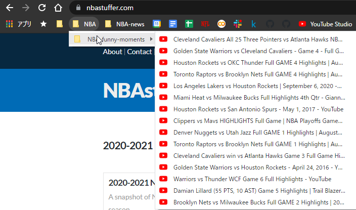

# bookmark-youtube-downloader
download chrome bookmarked youtube movies

1. install [youtube-dl]()
2. create output-bookmark-folder in chrome-browser
	- youtube/
3. create topic-bookmark-folder in output-bookmark-folder
	- youtube/NBA-funny-moment
4. bookmark YouTube movie in output-bookmark-folder
	- youtube/NBA-funny-moment/one-movie
5. execute this script
	- `python main.py output_local_direcotry`

